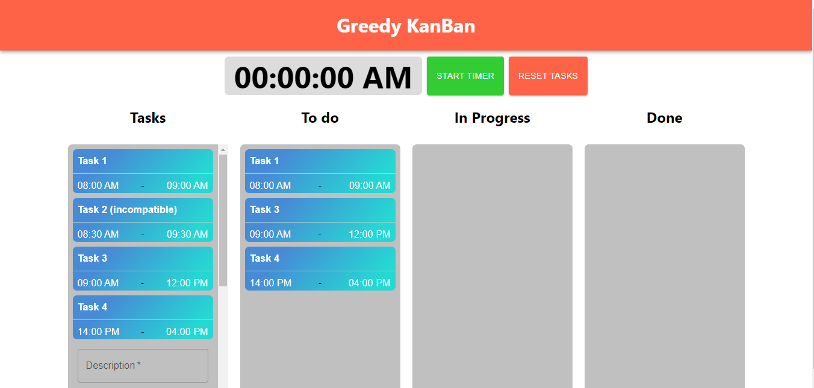
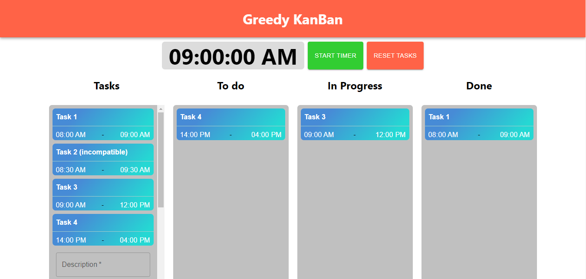
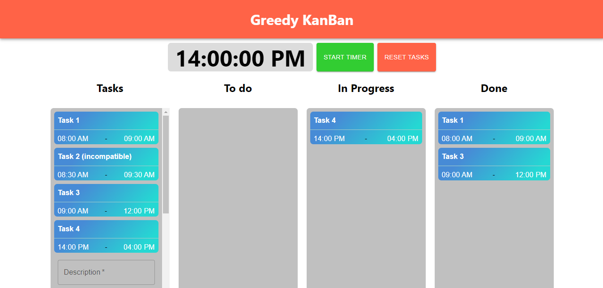

# Greedy KanBan

**Número da Lista**: 3<br>
**Conteúdo da Disciplina**: Greed Algorithms<br>

## Alunos
|Matrícula | Aluno |
| -- | -- |
| 19/0044799  |  Antônio Ferreira de Castro Neto |
| 18/0125885  |  Lucas Melo dos Santos |

## Sobre 
O Projeto Greedy KanBan gera uma demonstração visual de atividades em um quadro KanBan. As atividades são inseridas com um horário de início, uma duração e, consequentemente, um horário de término. Com isso, utilizamos o algoritmo ambicioso **Interval Scheduling** para retornar a sequência de atividades mais otimizada. 

A aplicação também gera uma animação com as tarefas e um cronômetro simulando o tempo. Dessa forma, as atidades vão progredindo, de acordo com sua duração, da coluna "To Do" até a coluna "Done" do Kanban. A animação é mostrada no vídeo de apresentação.

## Screenshots
## Tasks ordenadas

## Tasks ao longo do quadro Kanban pela animação



## Instalação 
**Linguagem**: JavaScript<br>
**Framework**: React JS<br>
**Pré-requisitos:**
* ter instalado na máquina **yarn** ou **npm**.
* Preferêncialmente rodar o projeto num ambiente Linux.

## Uso 
* Após clonar o repositório em sua máquina:

```
cd Greed_GreedyKanBan

yarn install

yarn start
```
ou 
```
cd Greed_GreedyKanBan

npm install

npm start
```

* Para cadastrar uma atividade, adicione uma descrição, horário de início e duração e clique no botão *insert Task*.
* Para ordenar as atividades, clique em *organize tasks*.
* Clique em *Start Time* para iniciar a animação e em *Reset Tasks* para resetar as atividades.

## Outros 
### **Importante** ⚠️
A aplicação pode **NÃO** rodar em ambiente **Windows 10 ou 11**, pois algumas dependências não funcionam nesses ambientes. 

A aplicação roda corretamente em ambientes Linux. 


